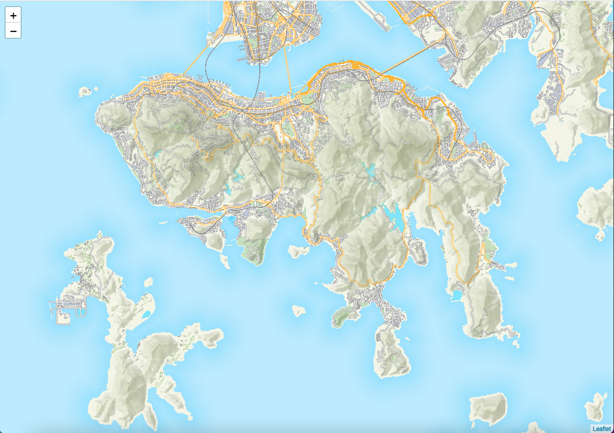
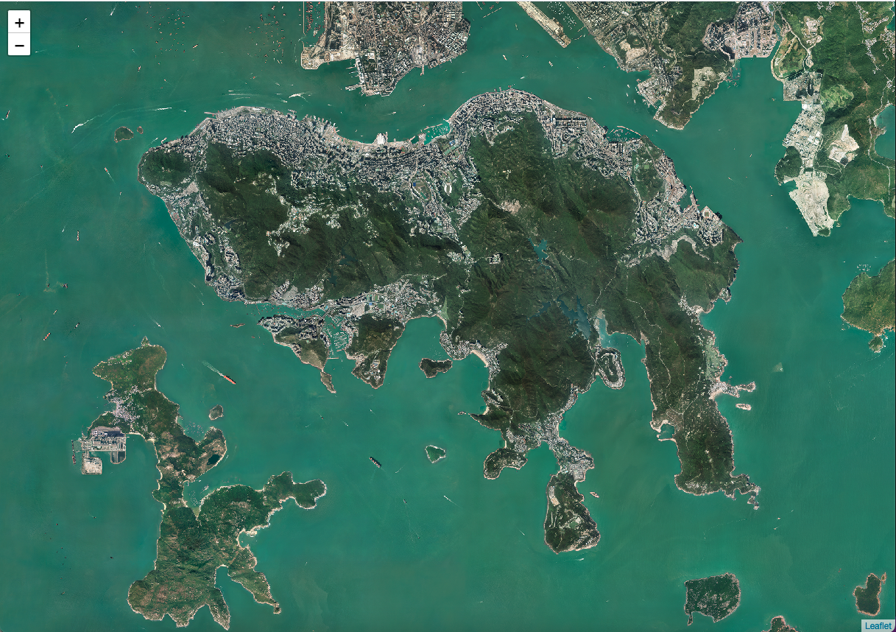
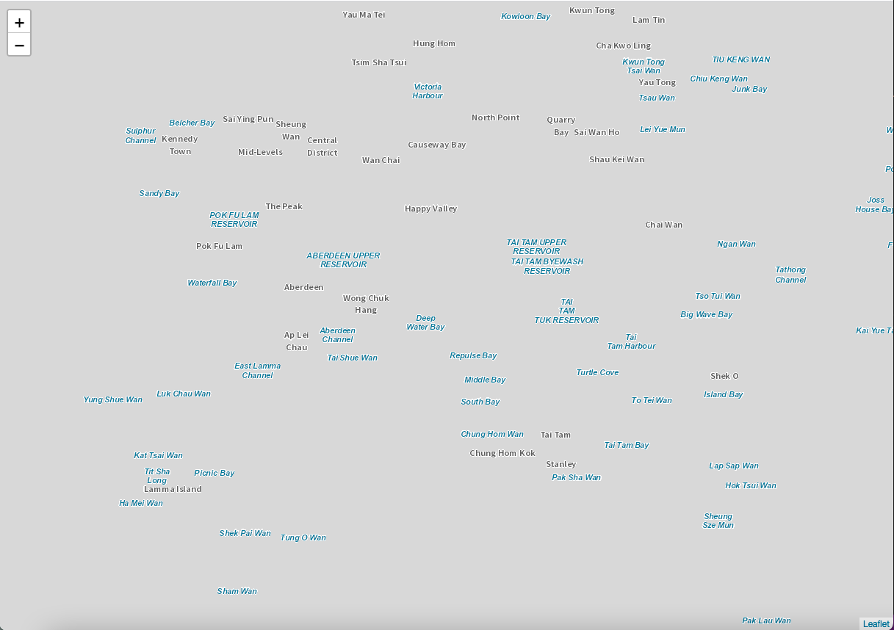
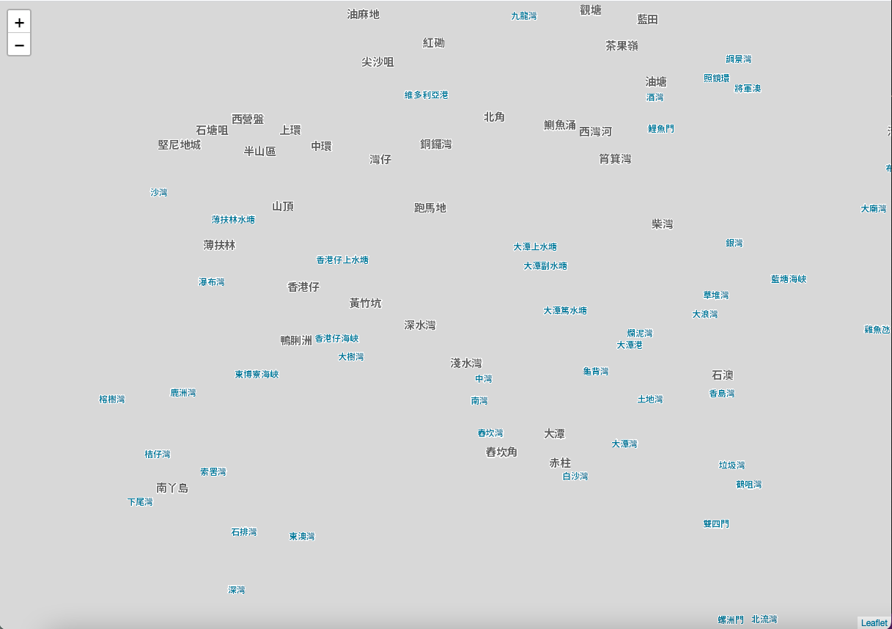
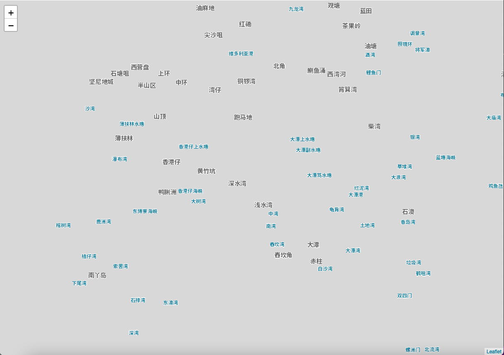

# Leaflet Hong Kong Tile Plugin

A Leaflet JS plugin to load the tile for Hong Kong Region. From [Hong Kong GeoData Store](https://geodata.gov.hk) provider.

There have 5 types of tile:

*   Topography
*   Imagery
*   Label in English
*   Label in Traditional Chinese
*   Label in Simplified Chinese

# Usage

There have 2 type of layer provided for this plugin

*   [L.TileLayer.HongKong](#ltilelayerhongkong) - Tilelayer either for basemap or label
*   [L.LayerGroup.HongKong](#llayergrouphongkong) - LayerGroup includes basemap and label overlay


#### Include the JS
```html
<link rel="stylesheet" href="https://unpkg.com/leaflet@1.7.1/dist/leaflet.css" />
<script src="https://unpkg.com/leaflet@1.7.1/dist/leaflet.js"></script>
<!-- Should include leaflet.js and leaflet.css before leaflet-hongkong-provider.js  -->
<script src="./leaflet-hongkong-provider.js"></script>
```

Load the tile layer to the map on HTML body
```html
<div>
    <div id="map"></div>
</div>
<script>
    var map = L.map('map').setView([22.245251, 114.188409], 13);
    L.layerGroup.hongKong("topography.tc").addTo(map;)
</script>
```

## L.TileLayer.HongKong

```L.TileLayer.HongKong``` load the Hong Kong tile as single layer, you can free to customize to mix this single layer to another layer. Two types of tile named 'basemap' and 'label'.

```javascript
// load the imagery tile
L.tileLayer.hongKong("basemap.imagery").addTo(map);
```

```javascript
// load the english label
L.tileLayer.hongKong("label.en").addTo(map);
```

Available options for ```L.TileLayer.HongKong```

*   [basemap.topography](#basemaptopography) - Topography basemap
*   [basemap.imagery](#basemapimagery) - Imagery basemap
*   [label.en](#labelen) - English label
*   [label.tc](#labeltc) - Traditional Chinese label
*   [label.sc](#labelsc) - Simplified Chinese label


## L.LayerGroup.HongKong

```L.LayerGroup.HongKong``` load the grouped Hong Kong map tile (basemap + label) with label overlay as single layer.

```javascript
// load the topography map with traditional chinese label
L.layerGroup.hongKong("topography.tc").addTo(map);
```

Option for the ```L.LayerGroup.HongKong``` consist of two parts:

[basemap].[label]

[basemap] is the map tile contains features on ground, such as road, building ... etc.

[label] is the label for the map feature

Available options for ```L.LayerGroup.HongKong```

basemap

*   topography - Topography
*   imagery - Imagery

label

*   en - English
*   tc - Traditional Chinese
*   sc - Simplified Chinese


# Sample Images

## Options for ```L.TileLayer.HongKong```

#### basemap.topography


#### basemap.imagery


#### label.en


#### label.tc


#### label.sc
